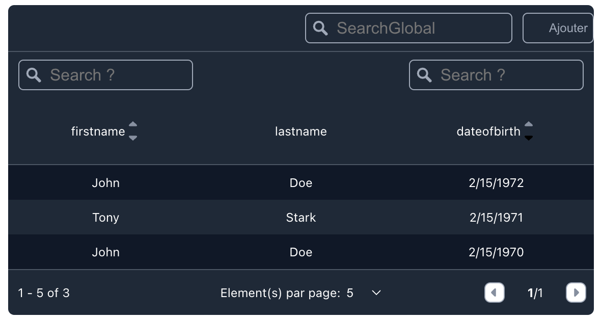

<!-- GETTING STARTED -->
## Getting Started

This repository contains a Datatable react-components for display your data



### Features

- DataTable
    - searchGlobal
    - paginator, Page navigation, view page
    - addElement: Button components

- Column
    - search column
    - sortable column
    - dataType: String Date
    - formatdateType: Tag region

## Dependencies
```json
    "@testing-library/jest-dom": "^5.17.0",
    "@testing-library/react": "^13.4.0",
    "@testing-library/user-event": "^13.5.0",
    "react": "^18.3.1",
    "react-dom": "^18.3.1",
    "react-router-dom": "^6.23.1",
    "react-scripts": "5.0.1",
    "web-vitals": "^2.1.4"
```
## Installation NPM

1. Install lib
   ```sh
   npm install simple-datatable-lib
   ```
2. Add in your project
   ```js
    import {DatatableCustom,ColumnCustom} from 'simple-datatable-lib/dist/components/DatatableCustom';
    function Datatable(props) {

        let buttonAdd = (<div className='container-button'>
                <button className="button-add" onClick={(e)=>{ alert("ADDELEMENT"); }}>
                    <p>Ajouter</p>
                </button>
            </div>
        );

        let data = [
            {firstname:"John",lastname:"Doe",dateofbirth: "1970-02-15T13:49:06.014Z"},
            {firstname:"Tony",lastname:"Stark",dateofbirth: "1971-02-15T13:49:06.014Z"},
            {firstname:"John",lastname:"Doe",dateofbirth: "1972-02-15T13:49:06.014Z"},
        ];

        return (
            <DatatableCustom id="MyDatatableID" data={data} searchGlobal paginator={[5,15,25,50,100]} addElement={buttonAdd} >
                <ColumnCustom field="firstname" sortable search></ColumnCustom>
                <ColumnCustom field="lastname" ></ColumnCustom>
                <ColumnCustom field="dateofbirth" dataType="date" formatdateType="en-US" sortable search></ColumnCustom>
            </DatatableCustom>
        );
    }
   ```

## Installation Github

1. Clone the repo
   ```sh
   git clone https://github.com/FlorentMarien/simple-datatable-lib
   ```
3. Install NPM packages
   ```sh
   npm install
   ```
4. Launch Example
   ```sh
   npm start
   ```